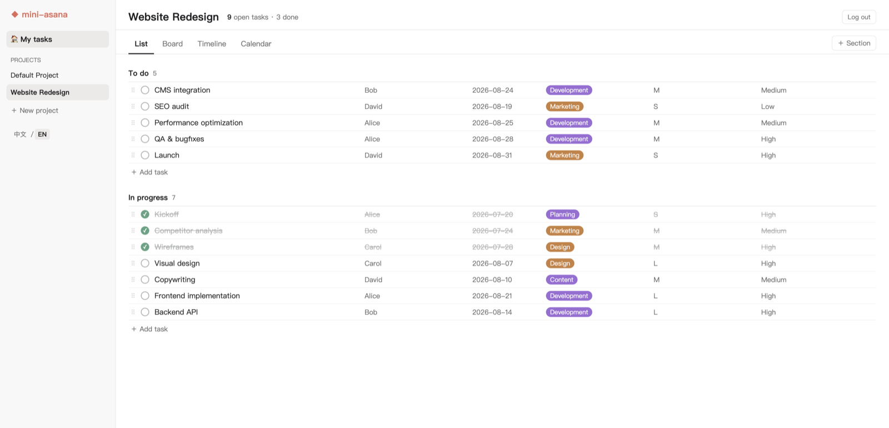
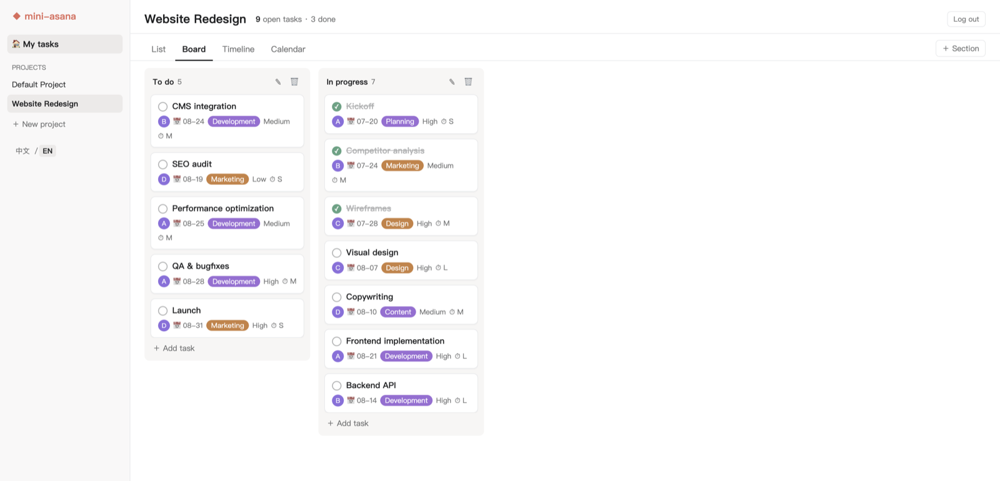
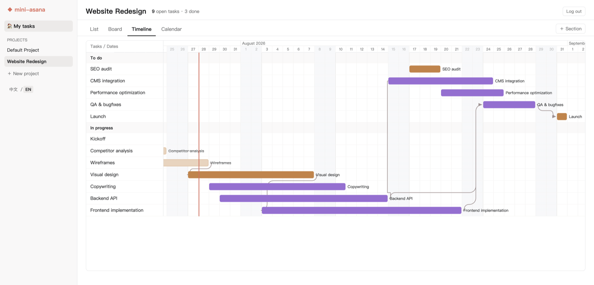
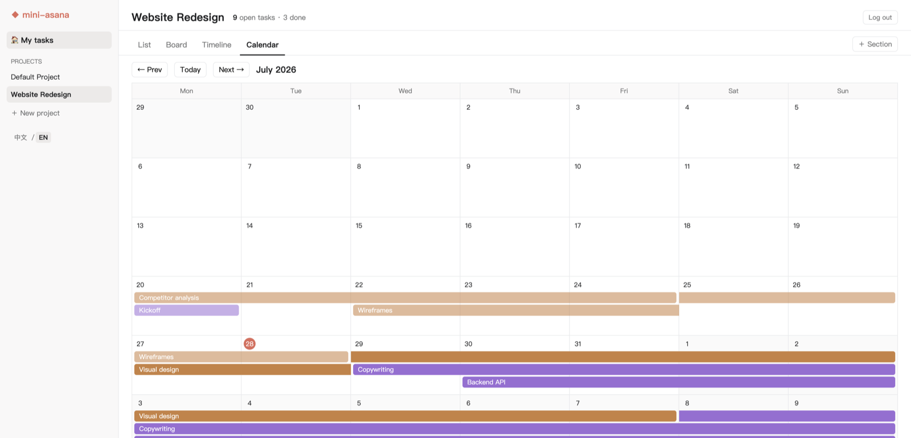
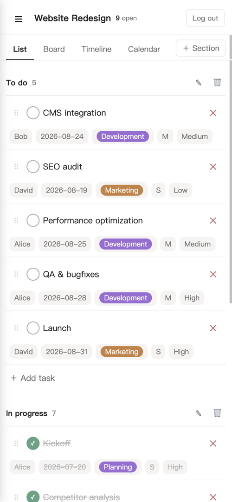

# mini-asana

A self-hosted, single-machine mini Asana — a personal project / home-improvement task tracker that runs on your own computer. Pure Python standard-library backend + vanilla JS frontend. No third-party dependencies, no build step: clone and run.

## Screenshots

**List** — inline editing of every field, category colors, drag to reorder



**Board** — drag cards across columns and within a column



**Timeline** — Gantt bars with dependency arrows, drag to reschedule



**Calendar** — month view with multi-day tasks as continuous bars



**Mobile** — responsive layout, touch long-press dragging



## Features

- **Multi-project**: create / switch / rename / delete projects in the left sidebar; data is stored in per-project files (`data/projects/`)
- **Four views**: list / board / timeline (Gantt) / calendar, switchable in the sidebar
- **List**: inline editing of every field (assignee, due date, Category, Effort, Priority), drag to reorder and move across sections, checkbox completion
- **List column sorting**: sticky column-header row; click a header to cycle asc → desc → off (back to manual order; ↑/↓ marks the active column). Chinese-aware text comparison, undated always last; display-only (never writes order), remembered per project, subtasks stay under their parent sorted among siblings, drag-reorder is disabled while a sort is active
- **Board**: drag cards across columns and within a column; "＋ Add section" dashed column at the right end creates a new column inline
- **Board filters**: filter bar with multi-select dropdown chips for assignee / Category / Priority / Effort (values present in the project, plus a None option) — OR within a dimension, AND across dimensions; per-column visible/total counts, clear-all chip, remembered per project
- **Smart groups**: saved cross-section filter views, stored server-side in the project DB and listed under the project in the sidebar. The rule editor combines assignee / Category / Priority / Effort multi-selects (values present in the project + None), due-date presets (overdue / today / this week / no date) and a status choice (incomplete only / completed only / all) — OR within a dimension, AND across, with a live human-readable summary. The group view aggregates matching tasks from all sections under their original section headers (empty sections hidden; a matched subtask whose parent didn't match shows a "↳ parent" hint), column-header sorting works inside it, drag-reorder is disabled; the selected group is remembered per project
- **Timeline**: drag bars to change start/due dates, drag edges to resize, dependency arrows (orthogonal routing with large rounded bends), multi-day and single-day bars, Shift/Cmd/Ctrl multi-select batch shifting (desktop), automatic task-name label placement
- **Calendar**: month view; multi-day tasks render as continuous bars; drag to reschedule (multi-day tasks shift as a whole)
- **Category coloring**: calendar blocks and timeline bars are auto-colored by Category, consistent across all views
- **Mobile support**: responsive layout, touch long-press dragging, bottom-sheet detail panel
- **Task detail panel**: section, parent task, assignee, start/due dates, Category/Effort/Priority, multi-select dependencies, notes, link
- **Subtasks (one level)**: nest a task under another by dragging it onto a row's body in List, or via the detail panel's Parent-task dropdown; drag out to un-nest. Collapse/expand with disclosure triangles in List and Timeline (remembered per project) — Timeline parent bars also carry an on-bar caret (placed outside-left on narrow bars); subtasks indent deeper in List for a clear visual hierarchy, and their timeline bars start with a matching small visual gap (dates unaffected), and a subtask without its own category inherits its parent's bar color (display only); parents show a done/total progress badge; board cards carry a "↳ parent" label
- **Token access auth** (on by default, can be disabled) for public-exposure scenarios
- **Bilingual UI (中文 / English)**: language switcher at the bottom of the sidebar; remembers your choice (localStorage) and defaults to your browser language; dates and the login page are localized too

## Quick start

Requires Python 3.7+ (standard library only); nothing to pip install.

```bash
# start (listens on 127.0.0.1:8787 by default)
python3 server.py
```

On first start a default project (Default Project, with To do / In progress sections) is created automatically — no data file preparation needed.

Open `http://127.0.0.1:8787` in your browser.

### Auth (enabled by default)

- **On first start** a 32-char hex token is generated into `data/auth_token.txt` (file mode 600) with a notice printed to the terminal; later starts read the file as-is.
- The browser shows a login page first; enter the token to continue (stored in localStorage, sent automatically afterwards).
- Programmatic access carries the token in one of two ways:
  - `Authorization: Bearer <token>` request header
  - `?token=<token>` query parameter
- After `?token=` page auth, the served `index.html` has its `/app.js` and `/style.css` links automatically rewritten to carry the token plus a `&v=` version fingerprint (file mtime), so those asset requests pass auth and updated files bypass stale caches.
- Without a token: API requests get `401 {"error":"unauthorized"}`; page requests get the login page.
- **Disable auth** (local development only): `python3 server.py --no-auth`, or env var `MINI_ASANA_NO_AUTH=1`.
- **Change port**: `python3 server.py --port 9000`, or env var `MINI_ASANA_PORT=9000` (default 8787).
- To use your own token: write it into `data/auth_token.txt` (a single line of text) before starting.

You can also start with `./start.sh` (equivalent to `python3 server.py`, auth enabled).

### REST API

Projects:

```
GET    /api/projects                      -> {"projects": [{"id","name","task_count"}, ...]}
POST   /api/projects                      create project {"name": str}
GET    /api/projects/<pid>                project detail
PATCH  /api/projects/<pid>                rename project {"name": str}
DELETE /api/projects/<pid>                delete project (the last remaining project cannot be deleted)
```

Tasks / sections within a project scope (`<pid>` is the project id):

```
GET    /api/projects/<pid>/tasks              -> {"project","sections","tasks"}
POST   /api/projects/<pid>/tasks              create task (JSON body)
PUT    /api/projects/<pid>/tasks/<id>         update task fields (partial update)
DELETE /api/projects/<pid>/tasks/<id>         delete task
POST   /api/projects/<pid>/sections           add section {"name": str}
PUT    /api/projects/<pid>/sections/<name>    rename section {"name": new_name}
DELETE /api/projects/<pid>/sections/<name>    delete section (its tasks move to the first remaining section)
POST   /api/projects/<pid>/reorder            {"section": str, "ids": [task_id, ...]} reorder within a section
POST   /api/projects/<pid>/groups             create smart group {"name": str, "rules": obj} -> 201 {"id","name","rules"}
PUT    /api/projects/<pid>/groups/<gid>       update smart group (partial: name?/rules?)
DELETE /api/projects/<pid>/groups/<gid>       delete smart group (404 on unknown gid)
```

Smart-group `rules` is a free-form object; the UI writes `{assignee?, category?, priority?, effort?}` (value lists, `""` = none), `due?` (preset list: overdue/today/week/none) and `completed?` ("incomplete"/"completed"/"all"). The tasks GET response includes the project's `smart_groups` array; project files written before smart groups existed load with an empty list automatically.

Tasks accept an optional `parent_id` (on both `POST` create and `PUT` update; `null`/empty un-parents) for one-level subtasks. The server returns `400` when the parent does not exist in the project, is itself a subtask (one level only), is the task itself, or when the task already has subtasks. Subtasks follow their parent's section changes; deleting a parent turns its subtasks into top-level tasks.

Legacy single-project paths (`/api/tasks`, `/api/sections`, `/api/reorder`, etc.) still work and apply to the first (oldest) project in the index.

All writes are atomically persisted to the corresponding project's `data/projects/<pid>.json`.

## Data storage

- `data/projects.json`: project index `{"projects": [{"id","name"}, ...]}`; array order = sidebar project order.
- `data/projects/<id>.json`: one data file per project `{"project","sections","tasks"}`; writes go to a `.tmp` file first, then `os.replace` swaps it in atomically.
- Fresh install: a default project is created automatically on start.
- Upgrading from the legacy (single-file) version: on start, a legacy `data/tasks.json` is auto-migrated into the first project and the original file is renamed `data/tasks.json.migrated` — no data is lost; you can delete that backup file once you've verified the migration.

## Importing from Asana

1. Export your tasks from Asana and shape them into a Chinese-keyed JSON array with fields: `gid`, `任务名称`, `分组`, `负责人`, `开始日期`, `截止日期`, `已完成` ("是"/""), `Category`, `Effort`, `Priority`, `前置依赖` (task names, `;`-separated), `任务链接`.
2. Name the file `asana_tasks_full.json` and place it **one level above the project directory** (convert.py reads `../asana_tasks_full.json`).
3. Run `python3 convert.py` to generate `data/tasks.json`; unresolvable dependency names are printed to stderr as WARN lines.
4. Start the server: the generated legacy single file is auto-migrated into the first project on first start, as described above.

## Directory layout

```
mini-asana/
├── server.py            # backend: REST API + static files + token auth (stdlib only)
├── start.sh             # convenience start script
├── convert.py           # Asana export JSON -> data/tasks.json converter
├── static/
│   ├── index.html       # SPA entry
│   ├── app.js           # all frontend logic (vanilla JS, no build)
│   └── style.css
├── data/                # generated at runtime (gitignored)
│   ├── projects.json    # project index
│   ├── projects/        # one <id>.json per project
│   └── auth_token.txt   # access token
└── deploy/              # optional: macOS persistence & public exposure
    ├── local.miniasana.plist           # app persistence
    ├── local.miniasana-tunnel.plist    # cloudflared tunnel persistence
    ├── local.miniasana-backup.plist    # daily backup (03:17)
    ├── local.miniasana-watchdog.plist  # tunnel watchdog (every 120s)
    ├── backup.sh
    └── watchdog.sh
```

## Deployment (optional)

### macOS launchd persistence

The 4 plists under `deploy/` assume the project lives at `~/mini-asana`, and that `backup.sh` / `watchdog.sh` have been copied to `~/mini-asana/` (the plists reference that path):

```bash
# 1) replace the placeholder username (or edit by hand)
sed -i '' 's/YOUR_USERNAME/'"$(whoami)"'/g' deploy/*.plist

# 2) install and load
cp deploy/local.miniasana*.plist ~/Library/LaunchAgents/
launchctl bootstrap gui/$(id -u) ~/Library/LaunchAgents/local.miniasana.plist
# bootstrap the tunnel/backup/watchdog plists as needed
```

### Exposing via a cloudflared named tunnel

The tunnel plist in this repo is a quick-tunnel (`--url`) example; a named tunnel is recommended for production:

```bash
cloudflared tunnel login
cloudflared tunnel create <tunnel-name>
# edit ~/.cloudflared/config.yml:
#   tunnel: <tunnel-id>
#   credentials-file: /Users/YOUR_USERNAME/.cloudflared/<tunnel-id>.json
#   ingress:
#     - hostname: <your-domain>
#       service: http://localhost:8787
#     - service: http_status:404
cloudflared tunnel route dns <tunnel-name> <your-domain>
# persistence: change the tunnel plist's arguments to cloudflared tunnel run <tunnel-name>, then bootstrap
```

When exposing publicly, **keep auth enabled** (the default); the token is in `data/auth_token.txt`.

Note on caching: the app sends `Cache-Control: no-store` on every response, so Cloudflare's edge will not cache the login page, authenticated pages, or static assets — no extra cache rules are needed, and no cache purge is required after deploying updates.

### Daily backup and tunnel watchdog

- `backup.sh`: archives task data into `data/backups/`, keeping the latest 8; with the backup plist it runs daily at 03:17. Multi-project layout: packs `data/projects.json` + `data/projects/` into a `.tar.gz`; falls back to copying the legacy single-file `data/tasks.json` when present.
- `watchdog.sh`: every 2 minutes, checks whether your domain is properly served by Cloudflare edge (resolves the real edge IP via DoH first, then connects directly — avoiding fake-ip DNS interference); after 2 consecutive failures it kickstarts the tunnel service. Two key parameters can be overridden via environment variables:
  - `WATCHDOG_DOMAIN`: domain to monitor (default `your-domain.example.com` — must be changed)
  - `WATCHDOG_TUNNEL_LABEL`: launchd Label of the tunnel service (default `local.miniasana-tunnel`)

## Tech notes

- **Zero dependencies**: the backend uses only the Python standard library (threaded `http.server`, atomic JSON writes, token auth); the frontend is vanilla HTML/CSS/JS with no npm and no build — edit and refresh
- Data as files: per-project storage (`data/projects/<id>.json` + `data/projects.json` index); writes go to `.tmp` first, then `os.replace` atomically
- Timeline coordinate math, dependency-arrow path planning, and touch long-press dragging (Pointer Events) are all hand-rolled in the frontend
